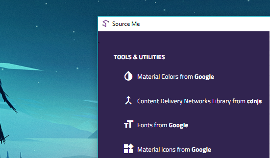

# Source me
> **Source Me** is a cross platform desktop application which has some essential tools while making a project.

<em>Version: 0.2.1</em>

## Features

- <strong>Material Design Colors by [Google](https://material.io/guidelines/style/color.html)</strong>
The application contains a full stack of material designed colors created by Google. These can be very useful when one needs these colors at one place. It uses <a href="https://github.com/wwayne/react-tooltip">`react-tooltip`</a> to show the hex codes.

- <strong>Content Delivery Networks Library by [CDN](https://cdnjs.com/)</strong>
These are libraries provided by cdn in one place. You can import the links to your project.

- <strong>Material Designed Icons by [Google](https://material.io/icons/)</strong>
These are material designed icons made by Google. It is similar to the colors component.

- <strong>Epsum Generator from [bacon ipsum](https://baconipsum.com/)</strong>
A generator which generates standalone text which can be useful to your HTML mockups.

- <strong>URL Shortner</strong>
A URL shortener which uses a free <a href="https://is.gd">is.gd</a> to shorten urls quickly.

- <strong>Emoji Picker</strong>
It is a picker which has a curated list of Emojis. Click one of them &amp; you get the unicode!

- <strong>Image Compressor</strong>
A tool which compresses your images quickly. It uses <a href="https://github.com/xkeshi/image-compressor">@xkeshi/image-compressor</a>.

## Use
<a href="https://github.com/theIYD/source-me/releases">Download the latest version of Source me from the releases page</a>

## Build

```bash
$ git clone https://github.com/theIYD/source-me.git
$ cd source-me
$ npm install
$ npm run dev
```

## Built with
- [React.js](https://reactjs.org/)
- [Electron.js](https://electronjs.org/)
