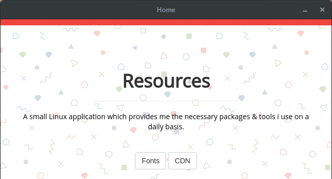

<h1 align="left">Source Me</h1>

<p align="left"><em>Source Me</em> is a small application which provides the necessary tools while developing a web application. The need for this application was because i was too lazy to go to the web & search for the packages, or fonts, or material design colors. So a small app was to be built to provide the necessary resources in a single click ! <br><br>The application is built on <a href="https://electron.atom.io/">Electron.</a></p><br><br>

<h2 align="left">Preview</h2><br>

<p align="left"></img></p><br><br>

<h2 align="left">Features</h2><br>

* **Fonts:** A list of Google Fonts library.
* **CDN:** A list of content delivery networks from *cdnjs*.
* **Material Colors:** A curated list of material colors from Google's Material Design.
* **Icons:** A container full of icons extracted from *[IonIcons](https://ionicons.com)*.

<br>
<br>

<h2>How To Use</h2>
<br>

<p>Clone the github repository. You need [Node.js](https://nodejs.org/) & [npm](https://www.npmjs.com/) installed your system. Go to terminal: </p>
<br>

```bash

# Clone the repository
$ git clone https://github.com/theIYD/source-me.git

# Go to directory
$ cd source-me

# Install dependencies
$ npm install 

# Start the app
$ npm run

```
<br>

<h6>Note: The app runs currently only on Linux systems.</h6><br><br>

<h2>Download</h2>
You can download the app from [here](#).

<br>
<br>

<h2>Thanks to</h2>
<br>

*[Electron.js](https://electron.atom.io/)
*[Node.js](https://nodejs.org)
*[npm](https://www.npmjs.com/)
*[Google](https://material.io/)
*[CDN](https://cdnjs.com/)
*[IonIcons](https://ionicons.com/)
*[jQuery](https://jquery.com/)
*[Github](https://github.com/)

<h2>License</h2>


